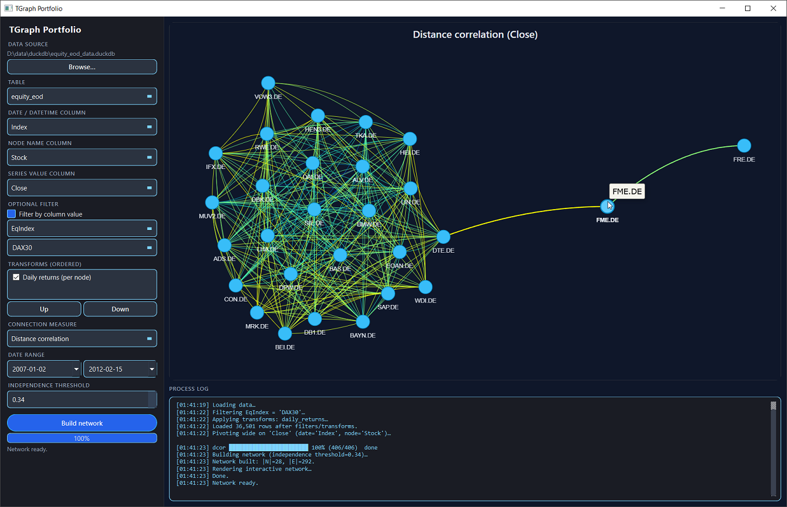
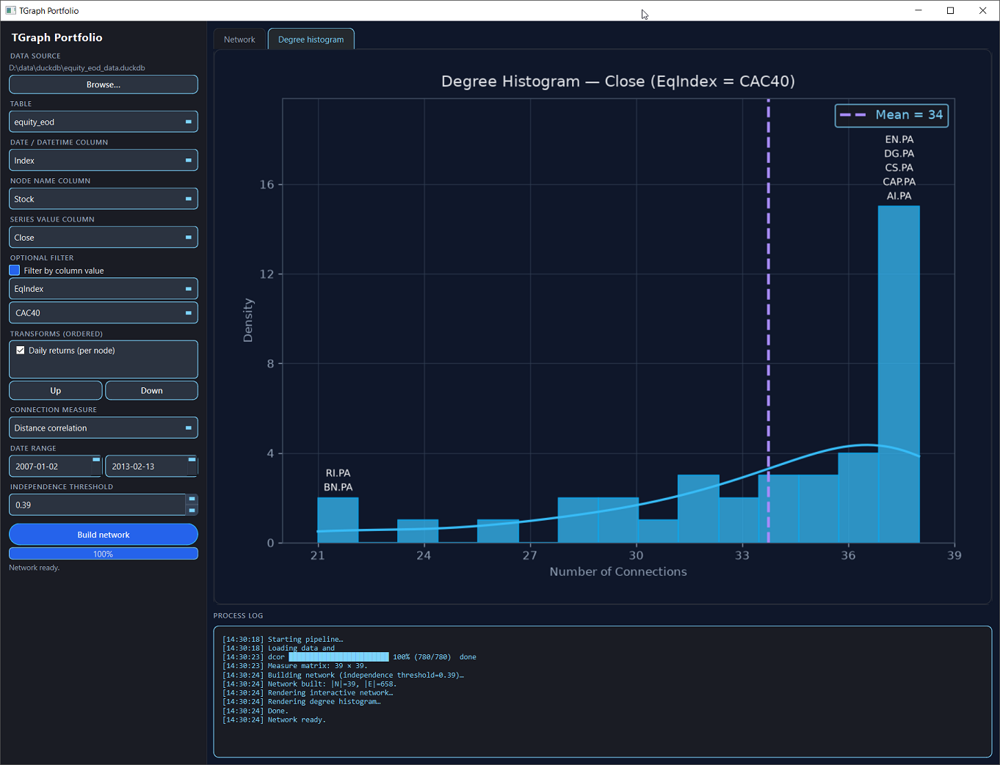
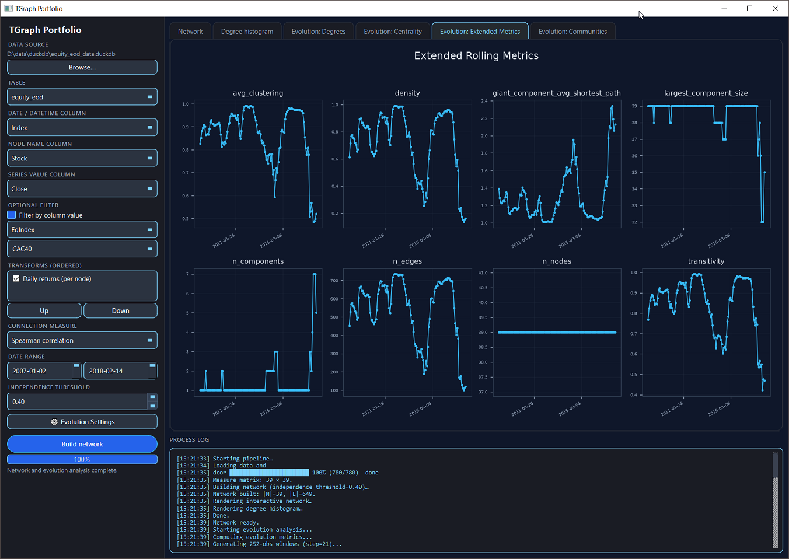
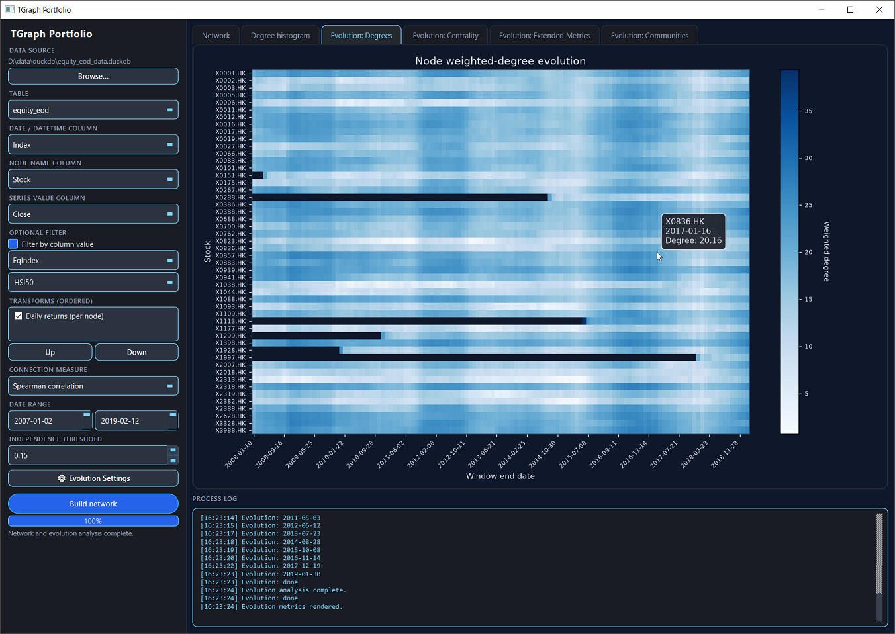
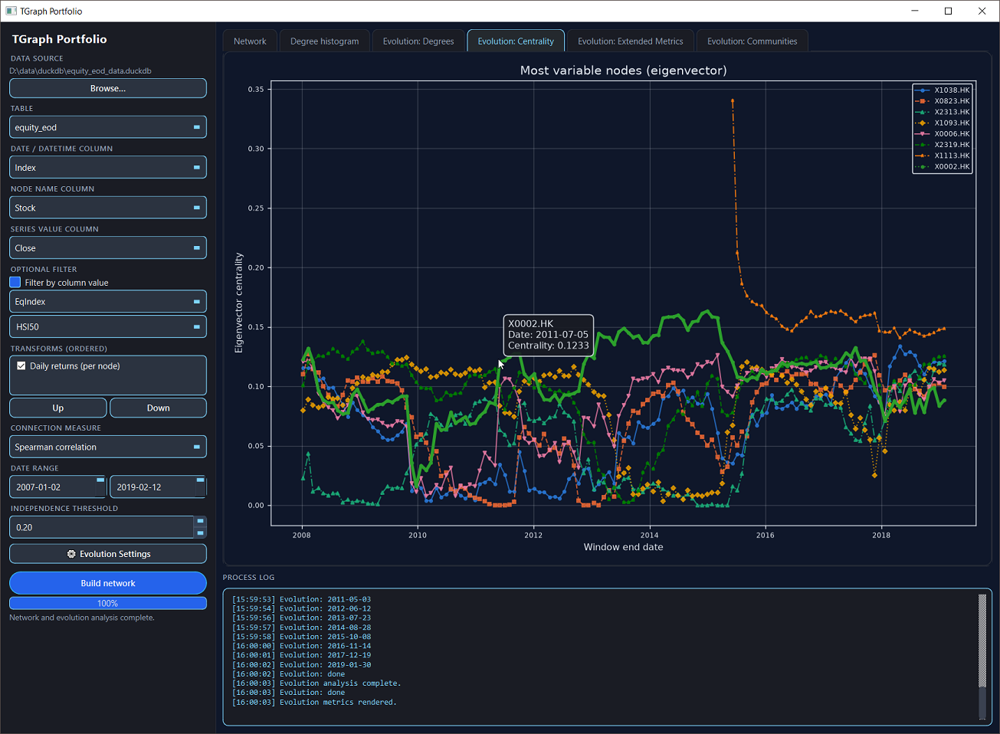
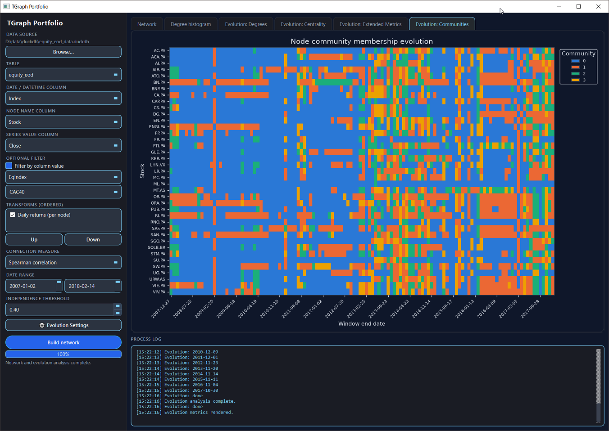

# TGraph Portfolio

## Overview
The goal of this project is to provide deep insights into the temporal evolution of network structures derived from relationship patterns in multi-asset panel data over time. By transforming static cross-sectional relationships into a chronological sequence of networks (a time series of graphs), the platform exposes the underlying structural shifts, transition dynamics, and regime changes in multivariate time series.

While the default analysis utilizes equity market panel datasets (such as DAX30 or CAC40 price returns), the system is built on a generalized, abstract database backend. It can be applied directly to **any multivariate time-series panel dataset** that has a temporal index, a node identifier (representing entities such as stocks, sensors, assets, or regions), and numeric series values.

### Methods Covered
The toolkit integrates several statistical and network analysis techniques:

1. **Pluggable Data Transforms**: Performs customizable node-wise preprocessing operations, such as computing daily simple returns, to prepare the panel data for connection modeling.
2. **Selectable Pairwise Connection Measures**:
   - **Distance Correlation**: Captures both linear and non-linear associations without assuming monotonic relationships.
   - **Pearson Correlation**: Evaluates standard linear correlation.
   - **Spearman Correlation**: Measures monotonic rank-based relationships.
   - **Maximal Correlation (ACE)**: Uses the Alternating Conditional Expectations algorithm to find nonparametric transformations that maximize correlation, capturing general (not necessarily monotonic) associations.
   - **Kendall Tau**: Rank-based correlation robust to ties and small samples; detects monotonic associations.
   - **DTW Distance**: Dynamic Time Warping similarity capturing phase-shifted but similar patterns; shape-based linkage.
   - **Shrinkage Correlation (Ledoit-Wolf)**: Denoised Pearson correlation via Random Matrix Theory; stabilizes correlation estimates when samples ≈ assets.
   - **Conditional Correlation**: Correlation computed only on high-magnitude return days; captures stress-regime linkage distinct from calm-period correlation.
   - **Mutual Information**: Non-linear, non-monotonic dependence detector; entropy-based measure of shared information.
   - **Chatterjee ξ**: Rank-based test for any dependence; computationally cheap alternative to distance correlation.
3. **Graph Construction and Thresholding**: Prunes weak connections using a user-defined independence threshold to build unweighted or weighted `NetworkX` graphs.
4. **Dynamic Network Visualization**: Renders interactive, physics-simulated network graphs utilizing `pyvis` to explore node connections dynamically.
5. **Static Descriptive Metrics**: Computes and labels extreme nodes (minimum, maximum, and mode degrees) on degree-distribution histograms styled for dark-mode visualization.
6. **Temporal Evolution Tracking**:
   - **Weighted Degree Heatmaps**: Visualizes how individual node connectivity changes chronologically across rolling or expanding windows.
   - **Centrality Trajectories**: Plots eigenvector, betweenness, or degree centrality of the most variable nodes over time to identify systemic shifts.
   - **Regime and Change-Point Detection**: Employs `graspologic`'s `latent_position_test` to statistically test whether consecutive window network snapshots share the same latent positions, flagging significant structural transitions with Holm-Bonferroni correction.
   - **Latent Trajectories**: Models dynamic community tracking and multi-graph latent position embedding via Joint/Omnibus Spectral Embedding.

## Quickstart

Requires [uv](https://docs.astral.sh/uv/) and Python 3.13+.

```bash
uv sync
uv run tgraph-gui
```

In the GUI, point the sidebar at a DuckDB or SQLite database, choose columns / filters, then click **Build Network**.

| Linked network | Degree distribution |
|:---:|:---:|
|  |  |

| Extended rolling metrics | Weighted-degree evolution |
|:---:|:---:|
|  |  |

| Centrality trajectories | Community membership evolution |
|:---:|:---:|
|  |  |

### Optional: Alternating Conditional Expectations (ACE)

The "Alternating Conditional Expectations (ACE)" measure depends on [`ace_cream`](https://github.com/FulgentMcGuffin/ace_cream), which compiles a Fortran extension and therefore requires a Fortran compiler (`gfortran`) plus a C compiler at install time. It is kept as an optional:

```bash
uv sync --extra ace
```

If not installed, or its compiled extension fails to import, the GUI omits "Maximal correlation (ACE)" from the connection-measure dropdown.


## Network Evolution Analysis

### Overview

Network evolution analysis extends static network snapshots into a **time series of networks**, revealing how relationship structures change across time. Rather than computing a single correlation network over an entire historical dataset, this module applies a sliding (or expanding) window to build hundreds of networks, each capturing the relationship structure within a specific time period. By tracking how network properties, node importance, and community structures evolve, analysts can detect:

- **Regime changes**: Abrupt shifts in market correlation structure (detected via latent-position hypothesis testing)
- **Gradual drifts**: Slow transitions in node centrality or community membership
- **Structural phases**: Periods of high clustering or modularity versus periods of fragmentation
- **Node trajectories**: How individual assets move through latent spaces defined by network position

### Core Concepts

#### Rolling and Expanding Windows

**Rolling Window** (default):
- Each window contains exactly `window_size` consecutive observations (e.g., 252 trading days ≈ 1 year)
- Windows advance by `step` observations at a time (e.g., 21 days ≈ 1 month)
- All windows have equal sample size, making metrics comparable across time
- Older observations are fully forgotten once they fall out of the window (captures regime change sharply)

**Expanding Window** (optional):
- Window start is pinned to the first available date
- Only the end advances, accumulating more data over time
- Later windows are noisier but also smoother (full history still influences each window)
- Useful for studying cumulative effects or learning curves

#### Connection Measures

Each window's network is constructed by computing a pairwise relationship measure (distance correlation, Pearson, Spearman, or ACE maximal correlation) on all node pairs within that window. Weak connections are pruned using an **edge threshold** (e.g., independent_threshold = 0.4 means keep edges with measure ≥ 0.4, uniformly across all connection types).

### Evolution Settings

The **Evolution Analysis Settings** dialog controls the temporal analysis parameters:

| Setting | Default | Meaning |
|---------|---------|---------|
| **Window size** | 252 obs | Number of consecutive observations per rolling window (e.g., trading days) |
| **Step size** | 21 obs | How many observations to advance between consecutive windows |
| **Min nodes/window** | 5 | Minimum number of unique nodes required per window (windows with fewer nodes are skipped) |
| **Centrality measure** | eigenvector | Centrality metric to track over time: `eigenvector` (influence via connections), `betweenness` (bridging importance), or `degree` (raw connectivity) |
| **Num nodes to plot** | 10 | Number of nodes to visualize in centrality and community plots; capped at ⌊total_nodes / 2⌋ |
| **Community method** | fixed | Strategy for detecting communities per window (see Community Detection Methods below) |
| **Max communities** | 10 | For `fixed` method: exact number of communities per window. For optimization methods: upper bound for search. |
| **Edge threshold** | 0.33 (read-only) | Keep edges where measure ≥ threshold (e.g., 0.33 means correlation ≥ 0.33 for all connection measures) |

### Community Detection Methods

Automatic community detection assigns nodes to clusters within each window using **Adjacency Spectral Embedding (ASE)** followed by **KMeans clustering**. Five strategies are available, each determining the number of communities (*k*) independently per window (guaranteeing **no lookahead bias**):

#### 1. **FIXED** — Hard Upper Bound
- Uses a fixed *k* for every window (specified by "Max communities")
- Simplest, most reproducible, but doesn't adapt to data
- Useful for enforcing business logic (e.g., "we always partition into 8 sectors")

#### 2. **SILHOUETTE** — Latent-Space Cohesion
- Maximizes average silhouette coefficient in the latent (ASE) embedding
- Balances intra-cluster cohesion with inter-cluster separation
- Default for `graspologic`'s auto-k selection; data-driven but latent-space-only

#### 3. **MODULARITY** — Network-Aware
- Maximizes modularity in the **original network** (not latent space)
- Directly optimizes a classical graph-partitioning objective
- Prefers assortative (community-structured) networks; less sensitive to embedding geometry

#### 4. **DAVIES-BOULDIN** — Cluster Compactness
- Minimizes Davies-Bouldin index in latent space
- Penalizes overlapping or poorly-separated clusters
- Favors tight, well-isolated communities

#### 5. **CALINSKI-HARABASZ** — Variance Ratio
- Maximizes Calinski-Harabasz index in latent space
- Ratio of between-cluster to within-cluster variance
- Sensitive to cluster scale and separation; tends to favor more balanced partitions

**No Lookahead Bias**: Each window's community count depends only on that window's adjacency matrix and embedding, not on future windows. This ensures the analysis remains temporally valid for forecasting or real-time monitoring.

### Visualization Outputs

#### Weighted-Degree Heatmap
- **Rows**: Nodes (stocks, assets, etc.)
- **Columns**: Windows (time progression)
- **Color intensity**: Sum of edge weights for each node in each window
- **Interpretation**: Bright cells = nodes with many/strong connections at that time; dark cells = isolated nodes

#### Centrality Trajectories (Dual-Plot View)
- **Top plot**: Nodes with highest centrality variability (standard deviation across time)
- **Bottom plot**: Nodes with lowest centrality variability
- **Interpretation**: High-variability nodes are "movers" that shift importance; low-variability nodes are stable anchors
- **Interactive**: Hover to see exact values; click a node name in the legend to highlight it across both plots

#### Community Membership Heatmap
- **Rows**: Nodes
- **Columns**: Windows
- **Color**: Community assignment per window (auto-color-coded)
- **Interpretation**: Color changes indicate community membership drift; stable colors suggest structural persistence

#### Extended Rolling Metrics
- Faceted grid of 8 network-level metrics over time
- Includes degree, density, clustering, transitivity, and connectivity
- Reveals macro-level regime changes (e.g., crisis vs. normal periods)

#### Latent Trajectories (Omnibus Embedding)
- Top 6 most-moving nodes plotted in 2D latent space
- Each node's path shows how its position in the network evolves
- Arrows indicate temporal direction
- Reveals whether nodes converge, diverge, or drift gradually

### Typical Workflow

1. **Load Data**: Point the GUI at a DuckDB or SQLite database with multivariate time-series panel data
2. **Build Network**: Select date, node, and value columns; choose a connection measure
3. **Open Evolution Settings**: Configure windowing (size, step), centrality measure, and community detection method
4. **Run Analysis**: Click **Analyze Evolution** to compute all windows and generate visualizations
5. **Explore Results**: 
   - Check weighted-degree heatmap to spot nodes that became central/peripheral
   - Review centrality trajectories (top/bottom plots) for behavioral shifts
   - Examine community evolution to detect regime changes or clustering reorganizations
   - Study extended metrics for network-level regime identification
6. **Adjust and Re-run**: Tweak window size, step, or community method and re-analyze to validate findings

### Performance Considerations

- **Window count** scales inversely with step size (smaller step → more windows)
- **Per-window cost** scales with O(n²) pairs and O(n log n) per-pair distance correlation
- **Typical runtimes** (on modern hardware):
  - 252-day window, 21-day step, 252 trading days of data: ~1–2 minutes (≈135 windows, ~440 pairs/sec)
  - Weekly step: ~10–30 minutes (5× more windows)
  - Expanding mode: similar window count as rolling, but later windows are slower (larger samples)
- **Smoke test first**: Always run on a truncated date range (e.g., 1 year) before full-history analysis

## References

### Project Foundations & Libraries
* **Hedgecraft**: The portfolio management algorithm and network analysis foundations: [GitHub Repository](https://github.com/mayabenowitz/Hedgecraft).
* **graspologic (Python 3.13 Compatible Fork)**: Graph statistical algorithms optimized for modern Python and dependency stacks: [GitHub Repository](https://github.com/FulgentMcGuffin/graspologic).
* **NetworkX**: Network analysis and graph structures: [Official Site](https://networkx.org/) | [GitHub](https://github.com/networkx/networkx).
* **pyvis**: Interactive HTML-based network visualizations: [Documentation](https://pyvis.readthedocs.io/) | [GitHub](https://github.com/WestHealth/pyvis).
* **Polars**: High-performance, multi-threaded dataframe execution engine: [Documentation](https://docs.pola.rs/) | [GitHub](https://github.com/pola-rs/polars).

### Statistical Relationships & Correlation
* **Distance Correlation**: Capturing linear and non-linear association: [Wikipedia](https://en.wikipedia.org/wiki/Distance_correlation).
* **Pearson Correlation Coefficient**: Evaluating linear correlation: [Wikipedia](https://en.wikipedia.org/wiki/Pearson_correlation_coefficient).
* **Spearman's Rank Correlation Coefficient**: Monotonic relationship strength: [Wikipedia](https://en.wikipedia.org/wiki/Spearman%27s_rank_correlation_coefficient).
* **Kendall's Rank Correlation Coefficient (τ)**: Rank-based concordance measure robust to ties: [Wikipedia](https://en.wikipedia.org/wiki/Kendall_rank_correlation_coefficient).
* **Alternating Conditional Expectations (ACE)**: Nonparametric maximal-correlation transformation, per the "Bivariate case": [Wikipedia](https://en.wikipedia.org/wiki/Alternating_conditional_expectations).
  - **Implementation**: [ace_cream (Python 3.13 Compatible Fork)](https://github.com/FulgentMcGuffin/ace_cream).
  - **Foundational Paper**: Breiman, L., & Friedman, J. H. (1985). *"Estimating Optimal Transformations for Multiple Regression and Correlation."* Journal of the American Statistical Association, 80(391), 580-598: [DOI (Taylor & Francis)](https://doi.org/10.1080/01621459.1985.10478157).
* **Mutual Information**: Entropy-based measure of shared information between variables: [Wikipedia](https://en.wikipedia.org/wiki/Mutual_information).
* **Chatterjee's ξ (Xi) Correlation**: Rank-based correlation coefficient detecting any monotone association: [arXiv](https://arxiv.org/abs/1909.10140).

### Robust and Specialized Correlation Methods
* **Shrinkage Correlation (Ledoit-Wolf)**: Denoised correlation via Random Matrix Theory for high-dimensional, short-window settings: [Wikipedia](https://en.wikipedia.org/wiki/Shrinkage_(statistics)).
  - **Ledoit-Wolf Shrinkage**: Ledoit, O., & Wolf, M. (2004). *"Honey, I shrunk the sample covariance matrix."* Journal of Portfolio Management, 30(4), 110-119.
* **Conditional / Exceedance Correlation**: Correlation measured only during stress regimes (extreme returns) vs. calm periods: captures tail co-movement and crisis linkage.
* **Dynamic Time Warping (DTW)**: Shape-based similarity metric capturing phase-shifted but aligned patterns in time series: [Wikipedia](https://en.wikipedia.org/wiki/Dynamic_time_warping).

### Community Detection & Clustering

* **Silhouette Coefficient**: Average silhouette width for cluster cohesion and separation: [Wikipedia](https://en.wikipedia.org/wiki/Silhouette_(clustering)).
* **Modularity Optimization**: Maximizing community structure in networks: [Wikipedia](https://en.wikipedia.org/wiki/Modularity_(networks)).
  - **Reference**: Newman, M. E. (2006). *"Modularity and community structure in networks."* Proceedings of the National Academy of Sciences, 103(23), 8577-8582: [DOI (PNAS)](https://doi.org/10.1073/pnas.0601602103).
* **Davies-Bouldin Index**: Average similarity ratio between each cluster and its most similar cluster: [Wikipedia](https://en.wikipedia.org/wiki/Davies%E2%80%93Bouldin_index).
  - **Reference**: Davies, D. L., & Bouldin, D. W. (1979). *"A Cluster Separation Measure."* IEEE Transactions on Pattern Analysis and Machine Intelligence, 1(4), 224-227: [DOI (IEEE)](https://doi.org/10.1109/TPAMI.1979.4766909).
* **Calinski-Harabasz Index**: Ratio of between-cluster to within-cluster variance: [Wikipedia](https://en.wikipedia.org/wiki/Calinski%E2%80%93Harabasz_index).
  - **Reference**: Caliński, T., & Harabasz, J. (1974). *"A Dendrite Method for Cluster Analysis."* Communications in Statistics, 3(1), 1-27: [DOI (Taylor & Francis)](https://doi.org/10.1080/03610927408827101).
* **Spectral Clustering & ASE**: Adjacency Spectral Embedding for latent-space node clustering: [graspologic Documentation](https://graspologic.readthedocs.io/).
  - **Reference**: Levin, K., Roosta-Khorasani, F., Mahoney, M. W., & Priebe, C. E. (2018). *"Out-of-core spectral clustering via partwise stochastic optimization."* Machine Learning, 106(3), 333-368: [DOI (Springer)](https://doi.org/10.1007/s10994-017-5637-2).

### Multiple Hypothesis Testing

* **Holm-Bonferroni Method**: Sequentially rejective procedure controlling family-wise error rates: [Wikipedia](https://en.wikipedia.org/wiki/Holm%E2%80%93Bonferroni_method).
* **Foundational Paper**: Holm, S. (1979). *"A simple sequentially rejective multiple test procedure."* Scandinavian Journal of Statistics, 6(2), 65-70: [DOI (Wiley/JSTOR)](https://www.jstor.org/stable/4615733).

### Multi-Graph Latent Position Embedding
* **Omnibus Embedding Tutorial**: Simultaneously embedding multiple matched-vertex graphs into a common canonical coordinate system: [graspologic Tutorial](https://graspologic-org.github.io/graspologic/tutorials/embedding/Omnibus.html).
* **Foundational Paper**: Levin, K., Athreya, A., Tang, M., Lyzinski, V., & Priebe, C. E. (2017). *"A central limit theorem for an omnibus embedding of multiple random graphs and implications for multiscale network inference."* arXiv preprint arXiv:1705.09355: [arXiv Paper](https://arxiv.org/abs/1705.09355).

